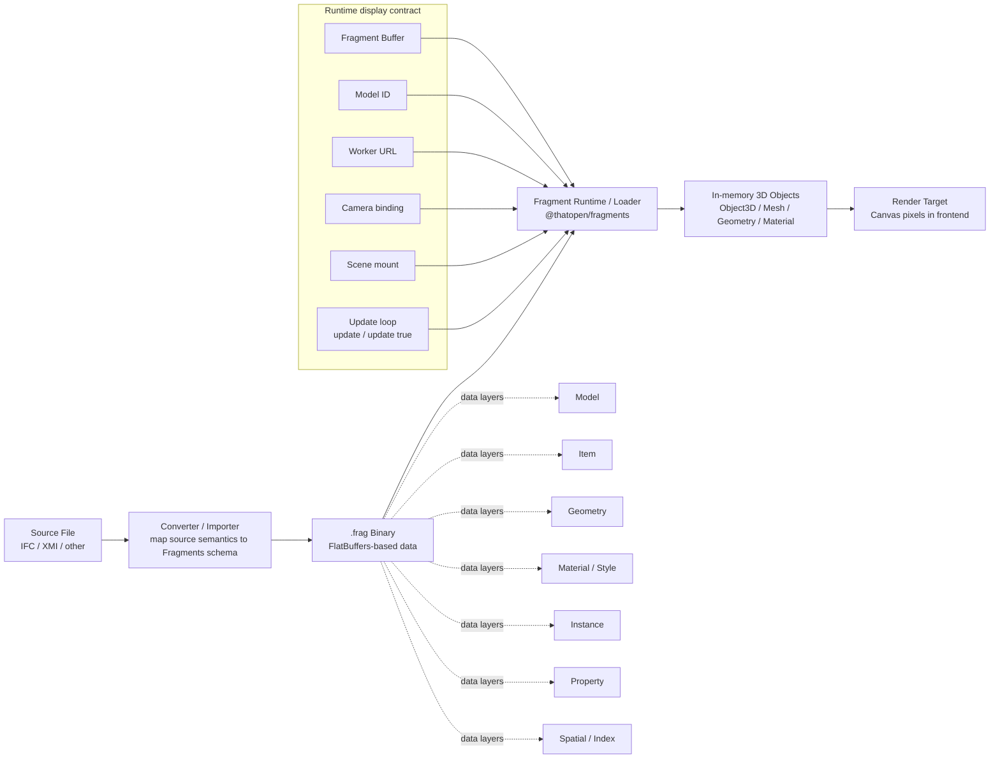

# Fragment Architecture Flowchart

This is the polished version of your hand-drawn architecture.

## Talking points

- Conversion stage and rendering stage are separate responsibilities.
- Loader does not create `.frag`; it reads `.frag` and instantiates runtime objects.
- Runtime objects are not files; they are in-memory objects used by renderer.
